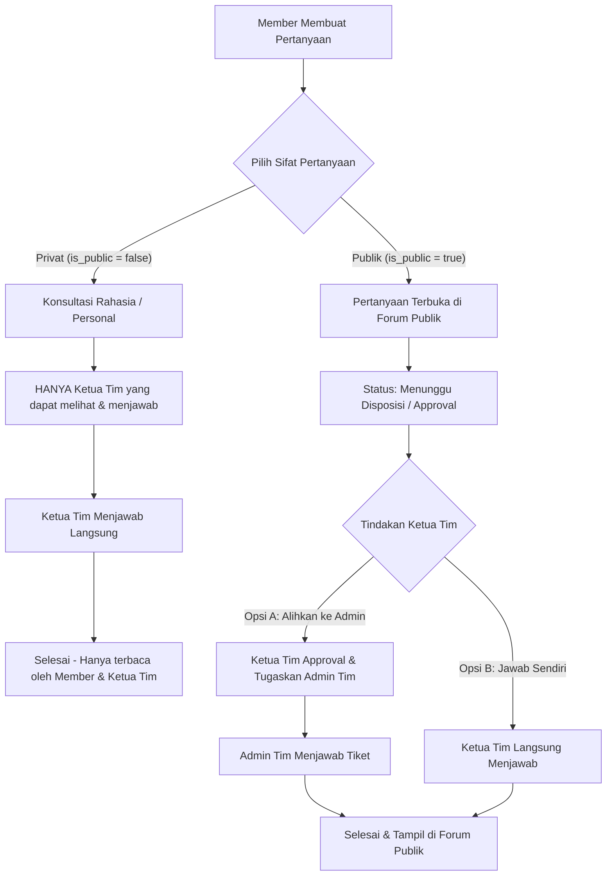

# Spesifikasi & Rencana Sistem Ticketing: Pertanyaan Privat vs Publik & Approval Admin Tim oleh Ketua Tim

## 1. Konsep & Prinsip Utama
Berdasarkan skema database terbaru (`20260928_bosdm_ticketing_schema.sql`), setiap pertanyaan dari Member/Pegawai memiliki klasifikasi visibilitas:

---

## 2. Rincian Aturan Bisnis & Hak Akses (RBAC Matrix)

| Fitur / Aksi | Member (Pengaju) | Admin Tim (Anggota Tim) | Ketua Tim (Leader/Approver) | Super Admin |
|---|---|---|---|---|
| **Pilih Sifat Pertanyaan (Publik / Privat)** | Ya (saat buat tiket) | - | - | - |
| **Melihat Tiket Privat (`is_public = false`)** | Hanya miliknya | **Dilarang (Hidden)** | **Bisa (Tim terkait)** | Bisa |
| **Menjawab Tiket Privat** | Tidak | **Dilarang** | **Bisa (Eksklusif)** | Bisa |
| **Melihat Tiket Publik (`is_public = true`)** | Semua Member (Forum) | Semua (Forum) | Semua (Forum) | Semua |
| **Approval / Alihkan Tiket Publik ke Admin** | Tidak | Tidak | **Bisa (Otoritas Penuh)** | Bisa |
| **Menjawab Tiket Publik** | Pesan lanjutan jika pembuat | **Bisa jika telah dialihkan/di-approve Ketua Tim** | Bisa kapan saja | Bisa |

---

## 3. Rencana Implementasi Fitur

### A. Data Layer & Layanan (`QuestionService` & `QuestionModel`)
1. **Model `QuestionModel`**:
   - Memastikan properti `isPublic` (boolean), `targetTim`, `status`, dan `assignedTo` terintegrasi penuh.
   - Filter query Supabase memastikan keamanan data (RLS Policy).
2. **Method `QuestionService`**:
   - `createQuestion(...)`: Mendukung flag `isPublic: true/false`.
   - `getQuestions(...)`: Filter otomatis (`is_public = true` untuk forum umum, filter khusus untuk panel Ketua Tim & Member).
   - `approveAndDelegateToAdmin(...)`: Ketua Tim menyetujui tiket publik dialihkan ke Admin Tim.
   - `answerAndResolveTicket(...)`: Menyimpan jawaban resmi dan mengubah status menjadi `selesai`.

---

### B. Antarmuka Pengguna (UI/UX)

#### 1. Form Pembuatan Pertanyaan (`AskQuestionScreen`)
- Pilihan interaktif 2 kartu:
  - 🟢 **Publik**: Muncul di Forum Publik untuk pembelajaran bersama seluruh pegawai.
  - 🟣 **Privat**: Rahasia, langsung ditujukan ke Ketua Tim (tidak dapat diakses oleh admin/anggota tim biasa).

#### 2. Panel Dashboard Ketua Tim (`KetuaTimDashboardScreen`)
- **Menu 1: Konsultasi Privat Masuk** (`is_public: false`, `menunggu_disposisi`) - Antrean khusus penanganan langsung oleh Ketua Tim.
- **Menu 2: Antrean Tiket Publik Tim** (`is_public: true`, `menunggu_disposisi`) - Untuk di-approve & dialihkan ke Admin Tim atau dijawab langsung.
- **Menu 3: Tiket Sedang Ditangani Admin** (`sedang_diproses`).
- **Menu 4: Tiket Selesai** (`selesai`).

#### 3. Panel Dashboard Admin Tim (`AdminDashboardScreen`)
- **Menu 1: Tiket Publik yang Dialihkan ke Tim Saya** (`is_public: true`, `sedang_diproses` / `assigned_to`).
- **Menu 2: Tiket Selesai**.
- *Catatan*: Admin Tim tidak menampilkan menu tiket privat.

#### 4. Detail Tiket & Ruang Jawaban (`QuestionDetailScreen`)
- **Banner Privasi**:
  - Jika **Privat**: Banner ungu bertuliskan *"Tiket Konsultasi Privat - Hanya dapat dijawab langsung oleh Ketua Tim"*.
  - Jika **Publik**: Banner hijau bertuliskan *"Pertanyaan Publik - Terbuka di Forum"*.
- **Aksi untuk Ketua Tim**:
  - Pada tiket **Privat**: Tombol ungu *"Jawab Langsung (Ketua Tim)"*.
  - Pada tiket **Publik**: Tombol teal *"Alihkan ke Admin Tim"* dan tombol merah *"Jawab & Selesai"*.
- **Aksi untuk Admin Tim**:
  - Hanya muncul tombol *"Beri Jawaban Admin Tim"* jika tiket adalah **Publik** dan telah dialihkan/disetujui oleh Ketua Tim (`canAnswerQuestion == true`).

---

## 4. Rencana Pengujian (Testing)
1. **Uji Pembuatan Tiket**:
   - Member membuat tiket publik -> Masuk ke forum publik dan antrean tiket tim.
   - Member membuat tiket privat -> Tidak muncul di forum publik, hanya muncul di dashboard pengaju dan Ketua Tim terkait.
2. **Uji Otorisasi Menjawab**:
   - Admin Tim **tidak bisa** melihat/menjawab tiket privat.
   - Admin Tim **dapat menjawab** tiket publik setelah Ketua Tim melakukan *"Alihkan ke Admin"*.
   - Ketua Tim **dapat menjawab langsung** baik tiket privat maupun publik.
