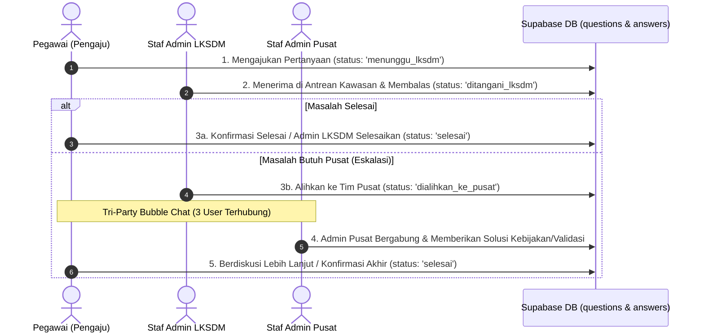

# Design Document: Tri-Party Bubble Chat & Unified Database Schema

**Tanggal**: 2026-10-01  
**Status**: Disetujui (Approved)  
**Tujuan**: Menetapkan arsitektur database Supabase dan alur bisnis terpadu untuk alur eskalasi 3 pihak (Pegawai $\rightarrow$ Staf Admin LKSDM $\rightarrow$ Staf Admin Pusat) dalam satu bubble chat interaktif.

---

## 1. Alur Bisnis (Business Flow)

---

## 2. Struktur Database (PostgreSQL / Supabase)

### A. Tabel `public.profiles`
* `id` UUID PRIMARY KEY REFERENCES auth.users(id) ON DELETE CASCADE
* `name` TEXT NOT NULL
* `email` TEXT UNIQUE NOT NULL
* `role` public.user_role_type (`pegawai`, `admin_lksdm`, `admin_pusat`, `ketua_tim`, `eksekutif`, `super_admin`)
* `unit` TEXT NOT NULL (misal: 'Kawasan Thamrin I', 'BOSDM Pusat')
* `tim` TEXT NOT NULL (misal: 'Layanan Kawasan SDM 1', 'Tim Ortala')
* `jabatan` TEXT NOT NULL
* `created_at` TIMESTAMPTZ DEFAULT NOW()

### B. Tabel `public.questions`
* `id` BIGSERIAL PRIMARY KEY
* `ticket_number` TEXT UNIQUE (Format: `TKT-YYYYMM-XXXX`)
* `user_id` UUID NOT NULL REFERENCES public.profiles(id)
* `judul` TEXT NOT NULL
* `isi` TEXT NOT NULL
* `status` TEXT NOT NULL DEFAULT 'menunggu_lksdm' (`menunggu_lksdm`, `ditangani_lksdm`, `dialihkan_ke_pusat`, `selesai`)
* `lksdm_kawasan` TEXT NOT NULL (Kawasan tempat pegawai bertugas)
* `target_tim_pusat` TEXT NOT NULL (Tim pusat target jika tiket dialihkan, misal: 'Tim Ortala')
* `tugas_fungsi_id` BIGINT REFERENCES public.tugas_fungsi(id)
* `tugas_fungsi_nama` TEXT
* `admin_lksdm_id` UUID REFERENCES public.profiles(id)
* `admin_pusat_id` UUID REFERENCES public.profiles(id)
* `created_at` TIMESTAMPTZ DEFAULT NOW()
* `updated_at` TIMESTAMPTZ DEFAULT NOW()
* `closed_at` TIMESTAMPTZ

### C. Tabel `public.answers`
* `id` BIGSERIAL PRIMARY KEY
* `question_id` BIGINT NOT NULL REFERENCES public.questions(id) ON DELETE CASCADE
* `user_id` UUID REFERENCES public.profiles(id)
* `sender_name` TEXT NOT NULL
* `sender_role` TEXT NOT NULL (`pegawai`, `admin_lksdm`, `admin_pusat`, `ketua_tim`, `system`)
* `isi_pesan` TEXT NOT NULL
* `attachment_url` TEXT (Opsional lampiran berkas/gambar pendukung)
* `created_at` TIMESTAMPTZ DEFAULT NOW()

---

## 3. Akun Demo Pengujian

* Pegawai: `pegawai@brin.go.id` (`Password123!`)
* Staf Admin LKSDM: `admin.lksdm1@brin.go.id` (`Password123!`)
* Staf Admin Pusat: `admin.pusat@brin.go.id` (`Password123!`)
* Ketua Tim: `ketuatim@brin.go.id` (`Password123!`)
* Eksekutif: `eksekutif@brin.go.id` (`Password123!`)
* Super Admin: `superadmin@brin.go.id` (`Password123!`)
